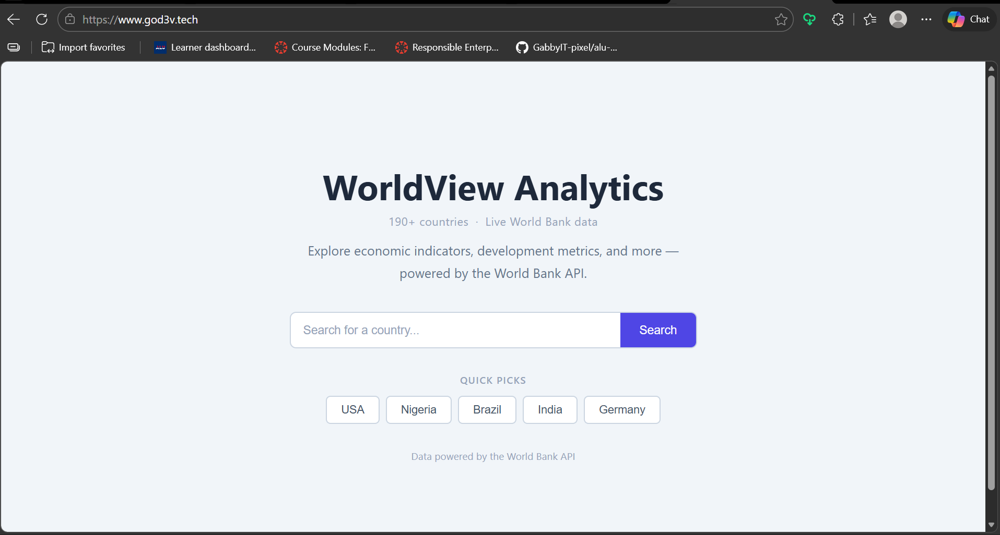
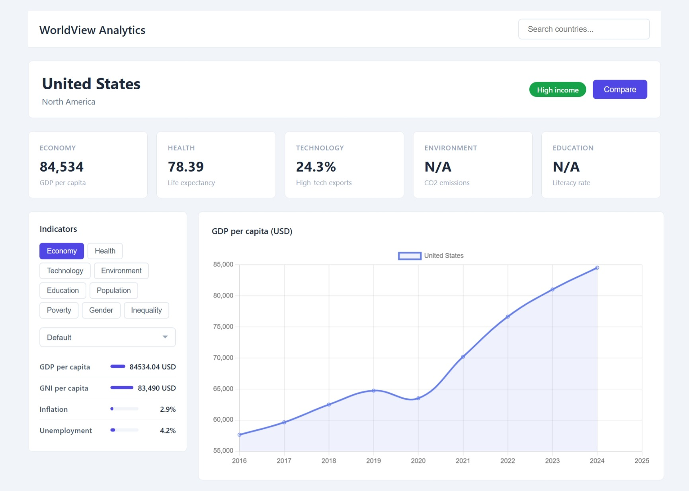

# WorldView Analytics

A web application that lets users explore real-time economic indicators, development metrics, and demographic data for 190+ countries — powered by the [World Bank API](https://datahelpdesk.worldbank.org/knowledgebase/articles/889392-about-the-indicators-api-documentation).

**Live app:** https://www.god3v.tech

> **No API key required.** The World Bank API is fully open. No `.env` file or environment setup is needed to run this project.

---

## Demo

[Watch the demo video](#) <!-- Replace # with your YouTube/Vimeo link -->

---

## Features

- **Country search** — search any country by name or select from quick picks
- **9 indicator categories** — Economy, Health, Technology, Environment, Education, Population, Poverty, Gender, Inequality
- **Live data** — all values fetched directly from the World Bank API (no mock data)
- **Progress bars** — visual comparison of each indicator relative to its global scale
- **10-year trend chart** — Chart.js line chart showing historical data for the active category
- **Country comparison** — overlay a second country's trend on the chart for side-by-side comparison
- **Sort indicators** — sort any category highest to lowest or lowest to highest
- **Error handling** — when the API returns no data for an indicator, the value displays as `N/A` and the progress bar renders empty rather than breaking. Invalid country searches trigger a clear alert message guiding the user to try the full country name.
- **Input validation & XSS protection** — all user inputs are sanitized before processing; all dynamic HTML is escaped before insertion into the DOM

---

## Screenshots





---

## Project Structure

```
WorldView-Analytics/
├── index.html              # Main HTML — landing page + dashboard
├── scripts/
│   ├── config.js           # WB API base URL and all indicator definitions
│   ├── api.js              # All World Bank API fetch functions and caching
│   ├── landing.js          # Landing page interactions (search, quick picks)
│   └── dashboard.js        # Dashboard UI rendering and event listeners
├── styles/
│   └── styles.css          # All styles (landing + dashboard + responsive)
└── README.md
```

---

## Running Locally

No build tools or dependencies required. This is a pure HTML/CSS/JS application.

1. Clone the repository:
   ```bash
   git clone https://github.com/garymurasira/Web-Infrastructure-summative-project....WorldView-Analytics
   cd Web-Infrastructure-summative-project....WorldView-Analytics
   ```

2. Open `index.html` in your browser:
   - Double-click `index.html`, **or**
   - Serve it with a local server for a cleaner development experience:
     ```bash
     # Python
     python -m http.server 8000

     # Node (if http-server is installed)
     npx http-server .
     ```
   - Then visit `http://localhost:8000`

---

## API Reference

### World Bank Indicators API

- **Base URL:** `https://api.worldbank.org/v2`
- **Documentation:** https://datahelpdesk.worldbank.org/knowledgebase/articles/889392-about-the-indicators-api-documentation
- **Authentication:** None required — fully open API, no key needed
- **Rate limits:** The World Bank API has no published hard rate limit. For normal single-user usage (a few dozen requests per page load), no throttling is applied. Avoid bulk automated requests.
- **Key endpoints used:**

| Endpoint | Purpose |
|---|---|
| `/country?format=json&per_page=500` | Fetch all countries for name-based search |
| `/country/{iso2}/indicator/{id}?format=json&mrv=5` | Fetch most recent value for an indicator |
| `/country/{iso2}/indicator/{id}?format=json&date={start}:{end}` | Fetch time series for chart |

---

## Deployment

The application runs on two web servers (Web01 and Web02) behind a load balancer (Lb01).

### Prerequisites on each web server

```bash
sudo apt update
sudo apt install nginx -y
```

### Deploy to Web01 and Web02

Run these steps on **both** Web01 and Web02:

1. SSH into the server:
   ```bash
   ssh -i your-key.pem ubuntu@<server-ip>
   ```

2. Create the app directory:
   ```bash
   sudo mkdir -p /var/www/worldview
   sudo chown -R ubuntu:ubuntu /var/www/worldview
   ```

3. From your **local machine**, transfer the files:
   ```bash
   scp -r -i your-key.pem index.html scripts/ styles/ ubuntu@<server-ip>:/var/www/worldview/
   ```

4. Configure Nginx on the server:
   ```bash
   sudo nano /etc/nginx/sites-available/worldview
   ```

   Paste the following:
   ```nginx
   server {
       listen 80;
       server_name _;

       root /var/www/worldview;
       index index.html;

       location / {
           try_files $uri $uri/ =404;
       }
   }
   ```

5. Enable the site and restart Nginx:
   ```bash
   sudo ln -s /etc/nginx/sites-available/worldview /etc/nginx/sites-enabled/
   sudo rm -f /etc/nginx/sites-enabled/default
   sudo nginx -t
   sudo systemctl restart nginx
   ```

6. Verify by visiting `http://<server-ip>` in your browser.

Repeat steps 1–6 for the second server.

---

### Configure the Load Balancer (Lb01)

The load balancer uses **HAProxy** to handle HTTPS termination and distribute incoming traffic between Web01 and Web02 using round-robin.

1. SSH into Lb01:
   ```bash
   ssh -i your-key.pem ubuntu@<lb01-ip>
   ```

2. Install HAProxy if not present:
   ```bash
   sudo apt update && sudo apt install haproxy -y
   ```

3. Edit the HAProxy config:
   ```bash
   sudo nano /etc/haproxy/haproxy.cfg
   ```

   Add or update the backend section with your actual server IPs:
   ```
   backend www-backend
       balance roundrobin
       server web-01 <web01-ip>:80 check
       server web-02 <web02-ip>:80 check
   ```

4. Verify the config and restart HAProxy:
   ```bash
   sudo haproxy -c -f /etc/haproxy/haproxy.cfg
   sudo systemctl restart haproxy
   ```

5. Visit `http://<lb01-ip>` — HAProxy will round-robin requests between Web01 and Web02.

---

### Verifying Load Balancing

To confirm traffic is being split between both servers, place a different identifier file on each server. When you request this file through the load balancer, the response should alternate between servers on each reload — confirming round-robin is working.

```bash
# On Web01
echo "Web01" | sudo tee /var/www/worldview/server.txt

# On Web02
echo "Web02" | sudo tee /var/www/worldview/server.txt
```

Then run this several times from your local machine:

```bash
curl http://<lb01-ip>/server.txt
```

The response should alternate between `Web01` and `Web02`.

---

## Challenges

- **World Bank API name search** — The WB API has no native name-search endpoint; it only supports ISO country codes. This meant users couldn't search by name out of the box. The solution was to fetch the full list of 250+ countries on startup, cache it in memory, and filter client-side on each search. This adds a one-time startup cost but makes all subsequent searches instant.

- **Missing/sparse data** — Many World Bank indicators have gaps: some countries haven't reported certain metrics in years, and some metrics simply don't apply to all countries. Rather than breaking the UI or showing misleading zeros, the app detects null API responses and displays `N/A` with an empty progress bar, keeping the interface readable regardless of data availability.

- **Dual-axis chart removed** — The original design showed GDP and Life Expectancy together on a single chart with two Y-axes. In practice this made the chart cluttered and hard to read because the scales (USD vs. years) were incompatible visually. The decision was made to show one indicator per chart with a consistent single axis, which also made the country comparison overlay much cleaner.

- **HAProxy conflict on Lb01** — When attempting to install and run Nginx as the load balancer, the service failed to start because HAProxy was already running on port 80. Rather than fighting the existing process, the approach was switched to configure HAProxy directly. This turned out to be a better outcome — HAProxy was already set up with SSL certificates and HTTPS support, which Nginx would have required additional configuration to achieve.

- **XSS protection** — Because user-supplied country names are processed and results are injected into the DOM via `innerHTML`, there was a risk of script injection if a malicious string was entered. A `sanitizeInput()` function was added to strip HTML characters from all inputs before processing, and an `escapeHTML()` function was added to encode any dynamic content before it is inserted into the DOM.

---

## Credits & Resources

| Resource | Version / Link |
|---|---|
| World Bank Indicators API | https://datahelpdesk.worldbank.org/knowledgebase/articles/889392 |
| Chart.js | v4.x (latest) — https://www.chartjs.org/ |
| World Bank Open Data | https://data.worldbank.org/ |

---


